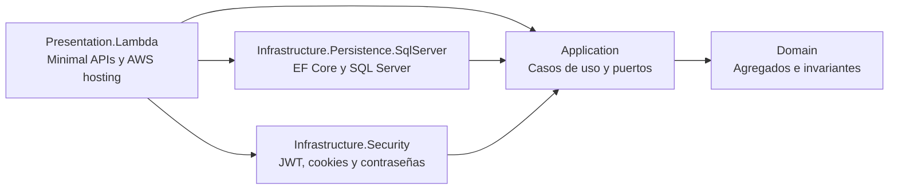

# Student Management API

API académica desarrollada con .NET 10 y SQL Server. Expone ASP.NET Core Minimal APIs y puede ejecutarse localmente como aplicación web o en AWS Lambda detrás de API Gateway.

## Responsabilidades

- Autenticación de administradores y estudiantes.
- Administración de programas, cursos, profesores y estudiantes.
- Creación, modificación y cancelación de matrículas.
- Consulta de compañeros que comparten un curso.
- Aplicación centralizada de reglas de dominio, autorización y validación.

## Arquitectura

La solución combina arquitectura hexagonal, Domain-Driven Design y organización vertical por caso de uso.



La dirección conceptual de las dependencias apunta hacia `Application` y `Domain`. Los detalles externos implementan contratos definidos por la capa de aplicación.

| Proyecto | Responsabilidad |
| --- | --- |
| `StudentManagementApi.Domain` | Agregados, entidades, value objects, identificadores, enumeraciones e invariantes sin dependencia de frameworks. |
| `StudentManagementApi.Application` | Commands, queries, handlers, validadores, contratos, especificaciones, resultados y puertos de persistencia/seguridad. |
| `StudentManagementApi.Infrastructure.Persistence.SqlServer` | EF Core, configuraciones, contextos, repositorios, transacciones, migraciones y bootstrap del administrador. |
| `StudentManagementApi.Infrastructure.Security` | Hash de contraseñas, JWT, cookies y acceso al usuario actual. |
| `StudentManagementApi.Presentation.Lambda` | Minimal APIs, hosting Lambda, OpenAPI, Problem Details, antiforgery, CORS y rate limiting. |
| `Test/*` | Pruebas unitarias del dominio y de la aplicación. |

## CQRS y persistencia

Los casos de escritura y lectura tienen dependencias diferentes:

```text
Command Handler -> IWriteRepository -> StudentManagementWriteDbContext -> SQL Server
Query Handler   -> IReadRepository  -> StudentManagementReadDbContext  -> SQL Server
```

- Los commands modifican agregados y se ejecutan dentro de transacciones serializables.
- Las queries usan un contexto dedicado sin tracking y especificaciones con proyección.
- `IQueryable`, `DbSet` y tipos de EF Core no salen de Infrastructure.
- `rowversion` implementa concurrencia optimista.
- Los enums se almacenan como texto legible.
- Los índices únicos protegen correos, documentos, códigos y asignaciones.

## Casos de uso

La carpeta `Application/Features` organiza cada operación verticalmente. Un caso de uso normalmente contiene:

```text
Feature/
├── OperationCommand.cs o OperationQuery.cs
├── OperationHandler.cs
└── OperationValidator.cs
```

MediatR desacopla los endpoints de los handlers. FluentValidation valida la entrada y Ardalis Result representa resultados esperados sin lanzar excepciones para reglas de negocio.

## Grupos de endpoints

Todas las rutas de negocio viven bajo `/api`.

| Grupo | Acceso | Ejemplos |
| --- | --- | --- |
| `/Authentication` | Público y autenticado | Token antiforgery, registro, login, logout y usuario actual. |
| `/AcademicPrograms` | Catálogo | Programas activos. |
| `/Courses` | Catálogo | Cursos activos por programa. |
| `/AdministrationAcademicPrograms` | Administrador | CRUD lógico de programas. |
| `/AdministrationCourses` | Administrador | CRUD lógico y asignación de profesor. |
| `/AdministrationProfessors` | Administrador | Creación, edición, activación y desactivación. |
| `/AdministrationStudents` | Administrador | Creación, edición, activación y desactivación. |
| `/Enrollments` | Estudiante | Crear, consultar, reemplazar cursos, cancelar y consultar compañeros. |
| `/StudentProfiles` | Estudiante | Consultar, actualizar y desactivar la cuenta actual. |

Swagger está disponible en `/swagger` y el documento OpenAPI en `/openapi/v1.json`.

## Reglas de negocio

- Un estudiante solo puede tener una matrícula activa.
- Una matrícula contiene exactamente tres cursos distintos del mismo programa.
- Cada curso vale tres créditos; la matrícula completa suma nueve.
- Los tres cursos seleccionados deben tener profesores diferentes.
- Un profesor puede impartir como máximo dos cursos dentro de un programa.
- Un curso utilizado por una matrícula activa no puede modificarse, reasignarse ni desactivarse.
- Las eliminaciones de negocio son desactivaciones o cancelaciones, nunca borrados físicos.
- Un estudiante solo puede consultar los nombres de compañeros que comparten sus cursos.

Las invariantes críticas viven en el dominio. Los handlers coordinan repositorios, permisos y transacciones, pero no duplican esas reglas.

## Seguridad

### Autenticación y antiforgery

1. El cliente solicita `GET /api/Authentication/GenerateAntiforgeryToken`.
2. La API escribe la cookie `__Host-student_csrf` y devuelve el token de solicitud.
3. Registro o login escriben el JWT en `__Host-student_access_token`; el token no aparece en el JSON.
4. Las solicitudes `POST`, `PUT`, `PATCH` y `DELETE` envían `X-CSRF-TOKEN`.
5. Después de cambiar la identidad se solicita un nuevo token antiforgery.

Las cookies son `Secure`, `SameSite=Strict`, tienen `Path=/` y usan el prefijo `__Host-`. La cookie JWT también es `HttpOnly`.

Los claims principales son:

- `sub`: identificador de la cuenta.
- `role`: `Administrator` o `Student`.
- `student_id`: identificador del estudiante cuando aplica.
- `jti`: identificador único del token.

### Configuración en AWS

Durante el arranque de Lambda, `AwsSecretsConfigurationExtensions` lee `APPLICATION_SECRET_ARN` y obtiene desde Secrets Manager:

- `ConnectionString`.
- `JwtSigningKey`.
- `BootstrapAdministratorEmail`.
- `BootstrapAdministratorPassword`.

La llamada utiliza el VPC Interface Endpoint de Secrets Manager. La política de ejecución de Lambda solo permite `GetSecretValue` sobre el secreto de la aplicación.

## Contrato de errores

Errores esperados se representan con `Ardalis.Result` y un `ErrorCode` estable. La presentación los traduce a RFC Problem Details:

```json
{
  "title": "Estudiante no encontrado",
  "status": 404,
  "detail": "No se encontró el estudiante solicitado.",
  "code": "StudentNotFound",
  "traceId": "0H..."
}
```

Los textos visibles se mantienen en `ErrorMessages.es-CO.resx`. Las respuestas nunca exponen SQL, stack traces, hashes de contraseña, claves de firma ni tokens JWT.

## Desarrollo local

### Requisitos

- .NET SDK 10.
- SQL Server LocalDB o SQL Server.
- Herramienta `dotnet-ef` compatible con EF Core 10.

Desde `StudentManagementApi/`:

```powershell
Copy-Item .env.example .env
dotnet restore StudentManagementApi.slnx

dotnet ef database update `
  --project StudentManagementApi.Infrastructure.Persistence.SqlServer `
  --startup-project StudentManagementApi.Infrastructure.Persistence.SqlServer `
  --context StudentManagementWriteDbContext

dotnet run `
  --project StudentManagementApi.Presentation.Lambda `
  --urls https://localhost:7273
```

El factory de diseño busca primero `ConnectionStrings__StudentManagementDb` y, si no existe, carga el archivo `.env` recorriendo los directorios padre.

## Migraciones

Crear una migración:

```powershell
dotnet ef migrations add NombreMigracion `
  --project StudentManagementApi.Infrastructure.Persistence.SqlServer `
  --startup-project StudentManagementApi.Infrastructure.Persistence.SqlServer `
  --context StudentManagementWriteDbContext
```

Aplicarla localmente:

```powershell
dotnet ef database update `
  --project StudentManagementApi.Infrastructure.Persistence.SqlServer `
  --startup-project StudentManagementApi.Infrastructure.Persistence.SqlServer `
  --context StudentManagementWriteDbContext
```

En AWS Development, la Lambda aplica migraciones pendientes durante el arranque cuando `DatabaseInitialization__ApplyMigrations=true`. Después crea el administrador inicial de forma idempotente. En producción conviene convertir las migraciones en una operación explícita del despliegue.

## Compilación y pruebas

```powershell
dotnet build StudentManagementApi.slnx
dotnet test StudentManagementApi.slnx
```

Las pruebas cubren invariantes del dominio, transiciones de agregados, resultados, recursos de error, especificaciones y comportamiento de casos de uso.

## Documentación relacionada

- [README principal](../README.md)
- [Guía técnica completa](../docs/guia-tecnica-completa.md)
- [Arquitectura AWS](../docs/architecture/student-management-aws-architecture.md)
- [Terraform Development](../docs/terraform-development.md)
