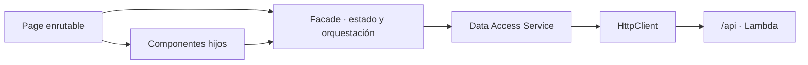

# Student Management Web

Frontend activo del portal académico. Fue creado como una aplicación Angular 22 independiente y consume la API Lambda mediante un único origen HTTPS.

> [!NOTE]
> Este es el frontend que compila y publica GitHub Actions.

## Stack

- Angular 22 y componentes standalone.
- TypeScript 6 en modo estricto.
- Signals para estado de interfaz y RxJS para flujos HTTP.
- Reactive Forms.
- SCSS y CSS Custom Properties.
- Angular CDK Overlay.
- Iconos SVG Lucide mediante un catálogo tipado.
- Vitest, ESLint y Prettier.

## Arquitectura

La aplicación usa una organización feature-first y mantiene un flujo de dependencias predecible:



- Las pages son contenedores de ruta y coordinan componentes de feature.
- Los componentes hijos presentan formularios, tablas, filtros y estados.
- Los facades exponen Signals readonly, orquestan casos de uso y controlan el estado de pantalla.
- Los servicios de `data-access/` contienen únicamente transporte HTTP y mapeo de DTO.
- Ninguna page consume `HttpClient` directamente.

## Estructura

```text
src/app/
├── core/
│   ├── api/                  contratos compartidos de API
│   ├── auth/                 sesión, guards y autorización
│   ├── http/                 interceptors y Problem Details
│   └── loading/              estado del loader HTTP global
├── features/
│   ├── authentication/
│   ├── administration/
│   ├── academic-programs/
│   ├── courses/
│   ├── professors/
│   ├── students/
│   ├── academic-catalog/
│   ├── enrollment/
│   └── student-profile/
├── layout/app-shell/         navegación autenticada
└── shared/
    ├── components/           modal, select, datepicker, iconos y controles
    ├── services/             servicios transversales
    └── utils/                utilidades puras
```

Las rutas de cada feature se cargan de forma diferida. Los formularios de creación y edición son componentes hijos presentados dentro de modales, mientras la page de la sección conserva filtros, tabla y paginación.

## Sistema visual y componentes compartidos

- Paleta minimalista en negro, gris y blanco.
- Botones de acción con icono SVG y texto.
- Modal compartido para creación, edición, éxito, advertencia, error y confirmación.
- Loader HTTP global presentado como modal de carga.
- Select y datepicker propios implementados como controles Angular.
- Angular CDK Overlay para mostrar menús y calendarios fuera del `overflow` del modal.
- Tablas, buscadores, estados vacíos y paginación con una línea visual común.

Los mensajes importantes usan el modal global; no se usan `alert()`, widgets nativos, toasts ni snackbars.

## Estado y flujo HTTP

```text
Interacción
  -> Facade actualiza estado de carga
  -> Data Access Service envía la solicitud
  -> Interceptors agregan credenciales y antiforgery
  -> API responde
  -> se cierra el formulario
  -> se muestra loader y luego modal de resultado
  -> se recarga la tabla cuando la operación fue exitosa
```

El loader utiliza reference counting para soportar solicitudes simultáneas. Peticiones que no deben bloquear la pantalla pueden excluirse mediante un `HttpContextToken`.

## Autenticación

- La URL base es `/api`; en AWS comparte dominio con el frontend.
- Todas las solicitudes se envían con credenciales.
- El JWT permanece en la cookie HttpOnly `__Host-student_access_token`.
- El frontend no guarda JWT ni secretos en `localStorage` o `sessionStorage`.
- Las operaciones inseguras agregan `X-CSRF-TOKEN` desde memoria.
- Los guards mejoran la navegación, pero la API continúa siendo la autoridad de autorización.
- Un `401` limpia la sesión en memoria y redirige al login.

## Contrato OpenAPI

- `docs/openapi.json` contiene una copia local del contrato.
- `scripts/verify-openapi.mjs` verifica operaciones y esquemas críticos.
- Fechas `DateOnly` viajan como `YYYY-MM-DD`.
- Fechas de auditoría utilizan ISO 8601 con zona.
- Los errores siguen RFC Problem Details e incluyen `code`, `traceId` y, para validación, errores por campo.

## Desarrollo local

### Requisitos

- Node.js `>=24.15 <25`.
- npm `>=11 <12`.
- API en `https://localhost:7273`.
- Certificado y llave PEM en `.certs/localhost.pem` y `.certs/localhost.key`.

Si no tienes certificados locales, puedes crearlos con `mkcert`:

```powershell
New-Item -ItemType Directory -Force .certs | Out-Null
mkcert -install
mkcert `
  -cert-file .certs/localhost.pem `
  -key-file .certs/localhost.key `
  localhost 127.0.0.1 ::1
```

Instalar y ejecutar:

```powershell
npm ci
npm start
```

La aplicación queda en `https://localhost:4200`. `proxy.conf.json` envía `/api` a `https://localhost:7273` y desactiva únicamente la validación del certificado del destino local.

## Scripts

| Comando | Acción |
| --- | --- |
| `npm start` | Servidor Angular Development con HTTPS y proxy. |
| `npm run build` | Build de producción en `dist/student-management-web/browser`. |
| `npm run lint` | Reglas de Angular ESLint. |
| `npm run typecheck` | TypeScript sin emitir archivos. |
| `npm run test -- --watch=false` | Pruebas unitarias una sola vez. |
| `npm run format:check` | Verifica formato con Prettier. |
| `npm run verify:contract` | Valida el contrato OpenAPI guardado. |
| `npm run verify` | Ejecuta toda la verificación anterior y el build. |

## Despliegue

Cuando cambia `StudentManagementWeb/**`, GitHub Actions:

1. Configura Node.js 24 y restaura la caché npm.
2. Ejecuta `npm ci` y `npm run build`.
3. Lee desde el estado de Terraform el bucket y la distribución.
4. Sincroniza `dist/student-management-web/browser` con S3 usando `--delete`.
5. Crea una invalidación `/*` de CloudFront.

Un cambio exclusivo del frontend no recompila la Lambda ni ejecuta `terraform apply`.

## Documentación relacionada

- [Contexto arquitectónico del frontend](FRONTEND_CONTEXT.md)
- [README principal](../README.md)
- [Guía técnica completa](../docs/guia-tecnica-completa.md)
- [Arquitectura AWS](../docs/architecture/student-management-aws-architecture.md)
