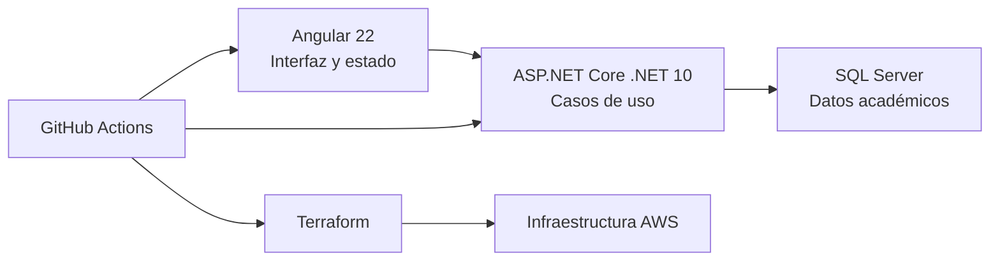
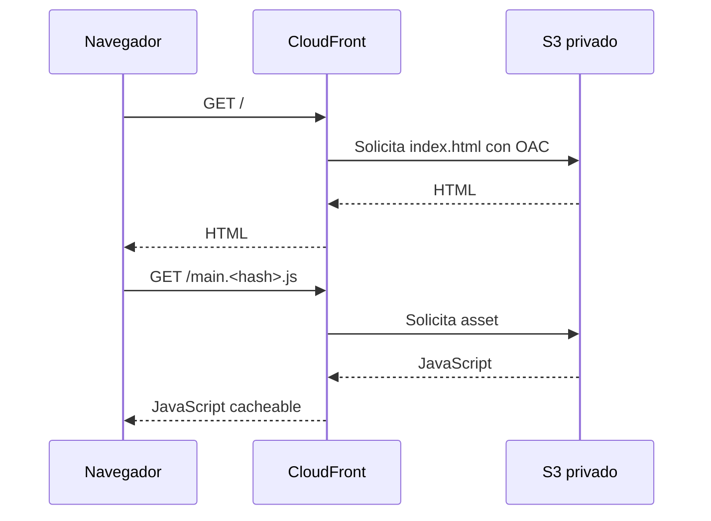
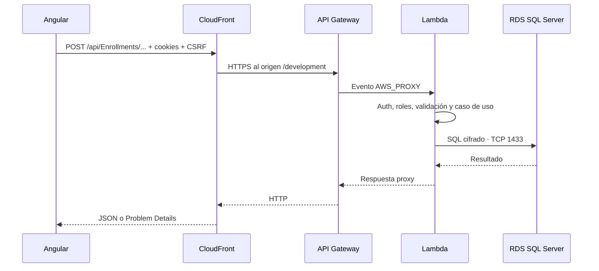
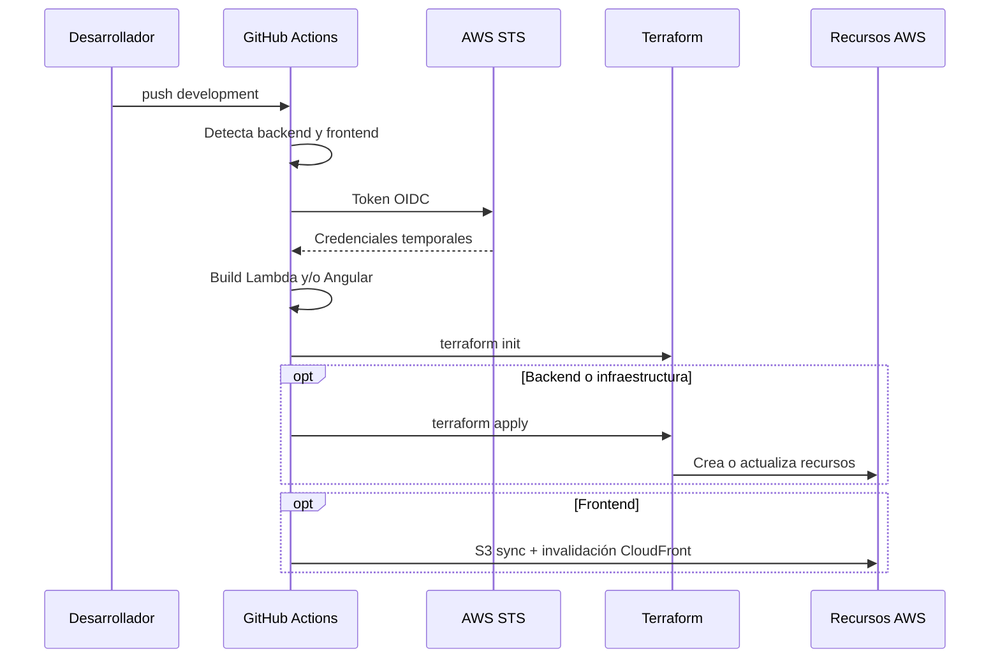

# Guía técnica completa de Student Management

Esta guía está pensada para estudiar el proyecto y poder explicarlo en una revisión técnica. Describe la arquitectura de aplicación, la infraestructura AWS, Terraform, GitHub Actions, los flujos de seguridad y las decisiones de Development.

## 1. Modelo mental del sistema

Student Management es una aplicación web de dos roles:

- **Administrador:** mantiene la estructura académica.
- **Estudiante:** gestiona su perfil y una matrícula de tres cursos.

El sistema tiene cuatro bloques:



La aplicación separa:

- **Qué ve el usuario:** Angular.
- **Qué reglas se aplican:** dominio y aplicación .NET.
- **Dónde se guardan los datos:** SQL Server.
- **Dónde se ejecuta:** AWS.
- **Cómo se reproduce el ambiente:** Terraform.
- **Cómo se entrega un cambio:** GitHub Actions.

## 2. Mapa del repositorio

```text
LT_StudentManagement/
├── StudentManagementApi/
│   ├── StudentManagementApi.Domain/
│   ├── StudentManagementApi.Application/
│   ├── StudentManagementApi.Infrastructure.Persistence.SqlServer/
│   ├── StudentManagementApi.Infrastructure.Security/
│   ├── StudentManagementApi.Presentation.Lambda/
│   └── Test/
├── StudentManagementWeb/
│   └── src/app/{core,features,layout,shared}
├── infrastructure/
│   ├── terraform/bootstrap/
│   ├── terraform/development/
│   └── cicd/
├── .github/workflows/development-deploy.yml
└── docs/
```

`StudentManagementWeb` contiene el frontend Angular y es la única implementación incluida en el pipeline.

## 3. Flujos completos

### 3.1 Carga del frontend



CloudFront fuerza HTTPS. S3 bloquea acceso público y solo confía en la distribución mediante su bucket policy.

Cuando el usuario actualiza una ruta Angular, por ejemplo `/admin/courses`, S3 no tiene un objeto con ese nombre. CloudFront convierte respuestas 403 o 404 en `200 /index.html`, permitiendo que Angular Router resuelva la ruta en el navegador.

### 3.2 Solicitud de API



CloudFront usa una política sin caché para la API y reenvía la información del viewer excepto el header `Host`, que debe corresponder al origen API Gateway.

### 3.3 Arranque en frío

En un cold start de Development:

1. AWS inicia el proceso .NET de la función.
2. `Program.cs` llama `AddApplicationSecretFromAwsAsync`.
3. El SDK resuelve Secrets Manager hacia el VPC Interface Endpoint.
4. La configuración incorpora conexión, clave JWT y bootstrap admin.
5. ASP.NET Core registra aplicación, persistencia, seguridad y endpoints.
6. Si `DatabaseInitialization__ApplyMigrations=true`, EF Core ejecuta `MigrateAsync`.
7. `AdministratorBootstrapper` garantiza la cuenta inicial.
8. La aplicación comienza a procesar solicitudes.

En invocaciones calientes el proceso y su configuración se reutilizan.

### 3.4 Despliegue



## 4. Arquitectura del frontend

### 4.1 Feature-first

El frontend se organiza por capacidades del negocio y no por tipo técnico global.

```text
features/courses/
├── components/ o componentes de formulario
├── data-access/
├── facade/
├── pages/
└── courses.routes.ts
```

Una page representa una sección enrutable. Los formularios de creación y edición son componentes hijos mostrados dentro de un modal compartido; no son páginas completas visualmente independientes.

### 4.2 Flujo de dependencias

```text
Page o Component
    ↓
Facade
    ↓
Data Access Service
    ↓
HttpClient
    ↓
Lambda API
```

La separación evita que las plantillas conozcan detalles HTTP y que los servicios de transporte controlen modales o navegación.

### 4.3 Estado

- **Signals:** estado de pantalla, selección, carga, resultados y sesión.
- **RxJS:** composición asíncrona de HttpClient.
- **Reactive Forms:** validación y control de formularios.
- **Facade:** punto de orquestación entre UI y API.

No se usa NgRx porque el alcance puede resolverse con estado local por feature y servicios singleton transversales.

### 4.4 Infraestructura compartida de UI

- Modal global para resultado y confirmación.
- Modal shell reutilizado por formularios de feature.
- Loader global con reference counting.
- Select y datepicker personalizados.
- Angular CDK Overlay para escapar de límites `overflow`.
- Catálogo tipado de iconos SVG.
- Normalización central de Problem Details.

### 4.5 Seguridad en el navegador

Angular no puede leer el JWT porque está en una cookie HttpOnly. Mantiene únicamente identidad, rol y estado de sesión en memoria.

El flujo antiforgery usa dos elementos:

- Cookie segura con material antiforgery.
- Token de solicitud enviado en `X-CSRF-TOKEN`.

Un atacante que provoque una solicitud cross-site puede lograr que el navegador envíe cookies bajo ciertas condiciones, pero no puede conocer el token de solicitud mantenido por la aplicación.

## 5. Arquitectura del backend

### 5.1 Dominio

`StudentManagementApi.Domain` expresa las reglas que siempre deben cumplirse. No depende de ASP.NET Core, EF Core ni AWS.

Conceptos principales:

- Cuenta y rol.
- Estudiante y profesor.
- Programa académico y curso.
- Matrícula y cursos seleccionados.
- Value objects para datos que requieren validación propia.

Una regla dentro del agregado sigue vigente aunque el caso de uso se invoque desde otro endpoint, una prueba o un futuro consumidor.

### 5.2 Aplicación

La capa Application define los casos de uso:

- Commands para cambios de estado.
- Queries para lectura.
- Handlers MediatR.
- Validadores FluentValidation.
- Especificaciones de consulta y proyección.
- Puertos `IReadRepository` e `IWriteRepository`.
- Contratos de seguridad y usuario actual.

Application conoce el dominio, pero no conoce EF Core, SQL Server, cookies ni Lambda.

### 5.3 Infraestructura de persistencia

Existen dos contextos sobre la misma base:

| Contexto | Uso |
| --- | --- |
| `StudentManagementWriteDbContext` | Tracking, cambios, transacciones y migraciones. |
| `StudentManagementReadDbContext` | Consultas `AsNoTracking` y proyecciones. |

Esto no son dos bases de datos; es una separación de comportamiento CQRS.

Ardalis Specification encapsula filtros, includes, orden, paginación y proyección. Los handlers no reciben `DbSet` ni construyen consultas EF directamente.

### 5.4 Infraestructura de seguridad

Implementa:

- Hash y verificación de contraseñas.
- Creación y validación JWT.
- Cookies de autenticación.
- Usuario actual a partir de claims.

La presentación protege grupos de endpoints por rol, pero el backend también valida estado de cuenta y pertenencia a recursos dentro de los casos de uso.

### 5.5 Presentación Lambda

`StudentManagementApi.Presentation.Lambda` contiene:

- Minimal API endpoints agrupados bajo `/api`.
- Adaptación Lambda REST API mediante `Amazon.Lambda.AspNetCoreServer.Hosting`.
- OpenAPI y Swagger.
- CORS local.
- Endpoint filter antiforgery.
- Problem Details.
- Rate limiting.
- Carga de Secrets Manager.

`AddAWSLambdaHosting(LambdaEventSource.RestApi)` permite usar el mismo pipeline ASP.NET Core localmente y dentro de Lambda.

### 5.6 Resultados y errores

Fallos esperados retornan `Ardalis.Result` con códigos estables. Fallos inesperados pasan al manejo global. La respuesta pública nunca usa el mensaje crudo de una excepción.

Esto permite que Angular decida el comportamiento usando `status` y `code`, mientras `traceId` permite correlacionar con logs.

## 6. Infraestructura AWS

### 6.1 Límites

- **CloudFront:** servicio global.
- **Región `us-east-1`:** S3, API Gateway, Lambda, RDS, Secrets Manager y CloudWatch.
- **VPC:** conectividad privada de Lambda, endpoint y RDS.
- **Zonas de disponibilidad:** dos subredes privadas.

Los servicios administrados no están automáticamente dentro de una VPC. S3, API Gateway, Secrets Manager y CloudWatch se dibujan fuera del límite VPC aunque pertenezcan al sistema.

### 6.2 Inventario

| Terraform | Recurso AWS | Función |
| --- | --- | --- |
| `aws_vpc.main` | Amazon VPC | Red `10.42.0.0/16`. |
| `aws_subnet.private[0..1]` | Subredes privadas | Conectividad Lambda y DB subnet group. |
| `aws_security_group.lambda` | SG Lambda | Egress 1433 y 443 solo dentro de la VPC. |
| `aws_security_group.database` | SG RDS | Ingress 1433 exclusivamente desde SG Lambda. |
| `aws_security_group.secrets_endpoint` | SG endpoint | Ingress 443 exclusivamente desde SG Lambda. |
| `aws_vpc_endpoint.secrets_manager` | AWS PrivateLink | Acceso privado al API de Secrets Manager. |
| `aws_db_instance.sql_server` | Amazon RDS | SQL Server Express privado. |
| `aws_secretsmanager_secret.application` | Secrets Manager | Configuración sensible de la aplicación. |
| `aws_lambda_function.api` | AWS Lambda | API .NET 10. |
| `aws_api_gateway_rest_api.api` | API Gateway REST | Entrada HTTP regional a Lambda. |
| `aws_s3_bucket.frontend` | Amazon S3 | Archivos Angular. |
| `aws_cloudfront_distribution.frontend` | CloudFront | Dominio, HTTPS, caché y enrutamiento. |

### 6.3 Red

```text
VPC 10.42.0.0/16
├── Subred privada A 10.42.0.0/20
└── Subred privada B 10.42.16.0/20
```

No hay Internet Gateway, NAT Gateway ni rutas `0.0.0.0/0`.

| Origen | Destino | Puerto | Razón |
| --- | --- | --- | --- |
| Lambda SG | RDS SG | TCP 1433 | Protocolo TDS de SQL Server. |
| Lambda SG | Endpoint SG | TCP 443 | API HTTPS de Secrets Manager. |

API Gateway invoca Lambda mediante el servicio Lambda y `aws_lambda_permission`; no necesita entrar por el Security Group de la VPC.

### 6.4 VPC Interface Endpoint

Una Lambda conectada a VPC envía su tráfico externo a través de esa red. Sin NAT no puede alcanzar el endpoint público de Secrets Manager.

PrivateLink crea una interfaz con IP privada y Private DNS. Por eso el SDK estándar puede seguir usando el hostname regional sin cambiar código.

El permiso IAM y la ruta de red resuelven problemas distintos:

- IAM responde **quién puede leer el secreto**.
- El endpoint responde **por dónde llega la solicitud al servicio**.

### 6.5 RDS

Configuración Development:

- Motor `sqlserver-ex`.
- Licencia incluida.
- Clase `db.t3.micro`, compatible con AWS Free Plan para SQL Server Express.
- 20 GB gp3.
- Single-AZ.
- Un día de retención de backups.
- Sin acceso público.
- Sin deletion protection.
- Sin snapshot final al destruir.

Estas opciones facilitan una demostración y reducen fricción operativa, pero deben revisarse para producción.

### 6.6 CloudFront y S3

CloudFront define:

- Comportamiento predeterminado hacia S3 con caché optimizada.
- `/api/*` hacia API Gateway sin caché.
- `/swagger*` y `/openapi/*` hacia API Gateway sin caché.
- Redirección a HTTPS.
- Certificado predeterminado de CloudFront.
- Fallback 403/404 a `/index.html`.

S3 permite lectura únicamente desde CloudFront OAC. El frontend no utiliza S3 Website Hosting.

## 7. Terraform

### 7.1 Qué resuelve

Terraform compara:

1. **Configuración declarada:** archivos `.tf`.
2. **Estado conocido:** `terraform.tfstate` remoto.
3. **Realidad:** recursos consultados a AWS.

Con esa comparación genera un plan y aplica las acciones necesarias para acercar la realidad a la configuración.

### 7.2 Conceptos utilizados

| Concepto | Ejemplo en el proyecto |
| --- | --- |
| Provider | `hashicorp/aws ~> 6.0` y `hashicorp/random ~> 3.7`. |
| Resource | `aws_lambda_function.api`. |
| Data source | Región, zonas disponibles y políticas administradas de CloudFront. |
| Variable | Región, clase RDS y ruta del ZIP Lambda. |
| Local | Prefijo común `student-management-development`. |
| Output | URL frontend, URL Swagger, bucket y distribución. |
| State | Objeto S3 bajo `student-management/development/terraform.tfstate`. |

### 7.3 Dependencias

Terraform infiere el orden a partir de referencias:

```hcl
subnet_ids = aws_subnet.private[*].id
```

La función no puede crearse antes que las subredes porque consume sus IDs. No hace falta escribir `depends_on` para esa relación.

El `depends_on` explícito de Lambda sobre la versión del secreto asegura que el contenido exista antes del primer arranque, aunque la función solo referencie directamente el ARN del secreto.

### 7.4 Bootstrap

El root bootstrap evita el problema circular de necesitar un bucket remoto antes de poder usar estado remoto. Crea:

- Bucket de estado.
- OIDC provider.
- Rol deployer.
- Service-linked role de RDS.

El estado bootstrap comienza localmente y debe conservarse o migrarse.

### 7.5 Estado remoto y locking

El root development declara un backend S3 vacío y GitHub completa:

```text
bucket       = TF_STATE_BUCKET
key          = student-management/development/terraform.tfstate
region       = AWS_REGION
use_lockfile = true
```

El lock impide dos `apply` simultáneos sobre el mismo estado. El versionado permite recuperar una versión anterior ante daño accidental.

El estado contiene contraseñas generadas, por lo que debe tratarse como información sensible aunque los outputs no las impriman.

### 7.6 Plan y apply

- `terraform init`: descarga providers y abre el backend.
- `terraform validate`: revisa estructura y tipos estáticos.
- `terraform plan`: calcula cambios sin ejecutarlos.
- `terraform apply`: ejecuta el plan.
- `terraform destroy`: elimina recursos administrados por ese estado.

## 8. GitHub Actions

### 8.1 Activación

El workflow se ejecuta por:

- Push a `development` con cambios en API, frontend, infraestructura o el workflow.
- `workflow_dispatch` manual.

`concurrency` agrupa ejecuciones bajo `student-management-development`. `cancel-in-progress: false` evita cancelar un apply en curso y reduce el riesgo de dejar operaciones incompletas.

### 8.2 Permisos

```yaml
permissions:
  contents: read
  id-token: write
```

- `contents: read` permite checkout.
- `id-token: write` permite solicitar el token OIDC.

No concede permisos AWS por sí mismo. AWS decide si confía en el token y qué permite el rol asumido.

### 8.3 Environment

El job usa `environment: Development`. Allí viven variables no secretas:

- `AWS_REGION`.
- `AWS_ROLE_ARN`.
- `TF_STATE_BUCKET`.

El Environment puede agregar aprobaciones y restricciones de rama si el repositorio lo requiere.

### 8.4 OIDC paso a paso

1. GitHub firma un JWT OIDC con claims de repositorio, referencia y environment.
2. La action de credenciales solicita `AssumeRoleWithWebIdentity`.
3. AWS valida el token contra `aws_iam_openid_connect_provider.github`.
4. La trust policy verifica `aud=sts.amazonaws.com` y el `sub` permitido.
5. AWS STS entrega Access Key, Secret Key y Session Token temporales.
6. Terraform y AWS CLI usan esas credenciales durante el job.

Ventaja: no existe una credencial AWS de larga duración almacenada en GitHub.

### 8.5 Detección selectiva

El checkout usa `fetch-depth: 0` para disponer de los commits necesarios. El script ejecuta:

```text
git diff --name-only BEFORE_SHA GITHUB_SHA
```

Luego calcula:

| Condición | `backend` | `frontend` |
| --- | :---: | :---: |
| Cambio API | true | false |
| Cambio Web V2 | false | true |
| Cambio Terraform | true | true |
| Cambio workflow | true | true |
| Manual o SHA inicial | true | true |

### 8.6 Build backend

```text
dotnet publish
  proyecto Presentation.Lambda
  Release
  runtime linux-x64
  framework-dependent
```

El directorio publicado se comprime en `StudentManagementApi/artifacts/student-management-api.zip`. Terraform calcula `filebase64sha256` y AWS actualiza el código cuando cambia el hash.

### 8.7 Build frontend

`npm ci` instala exactamente el lockfile. `npm run build` genera `dist/student-management-web/browser` con hashes en assets.

### 8.8 Terraform y publicación

`terraform init` siempre se ejecuta. `terraform apply` solo ocurre cuando `backend=true` porque el ZIP Lambda forma parte del grafo administrado.

Después:

- Backend: el job consulta el endpoint antiforgery hasta 12 veces, esperando migraciones y cold start.
- Frontend: obtiene bucket y distribución desde outputs, ejecuta `aws s3 sync --delete` e invalida `/*`.

La invalidación evita que CloudFront entregue una versión anterior de `index.html`.

## 9. Seguridad por capas

| Capa | Protección |
| --- | --- |
| Transporte | HTTPS en CloudFront y HTTPS hacia API Gateway. |
| Contenido | S3 privado con OAC. |
| Red | Subredes privadas y Security Groups referenciados entre sí. |
| Identidad de infraestructura | IAM para Lambda y OIDC para GitHub. |
| Secretos | Secrets Manager y endpoint privado. |
| Sesión | JWT en cookie segura HttpOnly. |
| CSRF | Cookie antiforgery + header de solicitud. |
| Autorización | Roles y validación del usuario actual. |
| Dominio | Invariantes en agregados. |
| Datos | Constraints, índices, transacciones y rowversion. |
| Observabilidad | CloudWatch Logs y traceId. |

## 10. Decisiones de Development y evolución a producción

| Development actual | Producción recomendada |
| --- | --- |
| RDS Single-AZ | Multi-AZ según RTO/RPO. |
| Un día de backups | Retención acorde a recuperación. |
| Sin deletion protection | Activarla. |
| Sin snapshot final | Exigir snapshot o política explícita. |
| Migraciones al arrancar Lambda | Job de migración separado y controlado. |
| Endpoint Secrets Manager en una subred | Endpoint por AZ o diseño de alta disponibilidad. |
| Certificado CloudFront predeterminado | Dominio propio y ACM. |
| IAM deployer amplio para Development | Policies más pequeñas y separadas por responsabilidad. |
| Un solo environment | Estados y cuentas separados por ambiente. |
| Swagger público por CloudFront | Restringirlo o deshabilitarlo. |

## 11. Cómo presentar el proyecto en diez minutos

### Minuto 1: problema

Explica los dos roles y la regla central de matrícula de tres cursos.

### Minutos 2 y 3: aplicación

Presenta Angular feature-first y el backend hexagonal/CQRS. Destaca que UI, casos de uso, dominio y detalles de persistencia están separados.

### Minutos 4 a 6: AWS

Recorre la primera página del `.drawio`:

1. Navegador y CloudFront.
2. S3 o API Gateway según path.
3. Lambda y controles de aplicación.
4. VPC, dos subredes, endpoint y RDS privado.
5. Secrets Manager y CloudWatch fuera de la VPC.

### Minutos 7 y 8: Terraform

Explica bootstrap frente a development, estado remoto, dependencias y por qué el estado es sensible.

### Minuto 9: GitHub Actions

Explica OIDC y despliegue selectivo. Usa la matriz backend/frontend.

### Minuto 10: seguridad y límites

Resume defensa por capas y reconoce decisiones exclusivas de Development que cambiarían en producción.

## 12. Preguntas de estudio

### ¿Por qué arquitectura hexagonal?

Para mantener las reglas y casos de uso independientes de EF Core, AWS y ASP.NET Core. Los detalles pueden reemplazarse implementando los mismos puertos.

### ¿CQRS implica dos bases de datos?

No. Aquí implica modelos y dependencias separadas para command/query, pero ambos contextos usan el mismo SQL Server.

### ¿Por qué CloudFront delante de API Gateway?

Para usar un solo dominio, cookies estrictas y enrutamiento por path, además de servir el frontend eficientemente.

### ¿Por qué S3 no es público?

CloudFront OAC firma las solicitudes. Evita que se omitan controles del punto de entrada y acceso directo al bucket.

### ¿Por qué Lambda está asociada a dos subredes?

Para permitir conectividad en dos zonas y cumplir el DB subnet group. AWS puede crear ENIs en las subredes configuradas.

### ¿Por qué existe el VPC Endpoint?

La Lambda necesita Secrets Manager, pero la VPC no tiene NAT. PrivateLink ofrece una ruta privada sin salida general a Internet.

### ¿IAM reemplaza al Security Group?

No. IAM autoriza acciones de AWS; Security Groups controlan tráfico de red. Para leer un secreto desde una Lambda privada se necesitan permiso y conectividad.

### ¿Por qué Terraform tiene bootstrap separado?

Porque el bucket de estado y la confianza OIDC deben existir antes de que el pipeline pueda utilizar estado remoto y autenticarse.

### ¿Por qué `terraform init` se ejecuta en frontend-only?

Porque el job necesita leer outputs del estado para saber dónde publicar Angular, aunque no vaya a aplicar cambios.

### ¿Por qué una ejecución manual despliega ambos?

Ofrece un redeploy completo predecible cuando no existe un diff de push confiable o se quiere recuperar el ambiente.

### ¿Por qué el JWT no se devuelve al JavaScript?

Una cookie HttpOnly reduce la exposición del token ante scripts inyectados. Antiforgery agrega protección para operaciones con estado.

## 13. Glosario

| Término | Definición |
| --- | --- |
| AZ | Zona de disponibilidad independiente dentro de una región. |
| CQRS | Separación de responsabilidades de lectura y escritura. |
| ENI | Interfaz de red elástica utilizada para conectividad dentro de VPC. |
| IaC | Infraestructura como código. |
| OAC | Origin Access Control de CloudFront para S3. |
| OIDC | Protocolo de identidad usado para federar GitHub con AWS. |
| PrivateLink | Acceso privado a servicios mediante Interface Endpoints. |
| RPO | Pérdida máxima de datos aceptable. |
| RTO | Tiempo máximo esperado para recuperar el servicio. |
| SG | Security Group, firewall stateful de recursos AWS. |
| SPA | Aplicación de una sola página ejecutada en el navegador. |
| STS | Servicio AWS que emite credenciales temporales. |
| TDS | Protocolo utilizado por SQL Server. |
| Terraform state | Mapa entre direcciones Terraform y recursos reales. |

## 14. Archivos para profundizar

- [`infrastructure/terraform/development/main.tf`](../infrastructure/terraform/development/main.tf)
- [`infrastructure/terraform/bootstrap/main.tf`](../infrastructure/terraform/bootstrap/main.tf)
- [`.github/workflows/development-deploy.yml`](../.github/workflows/development-deploy.yml)
- [`StudentManagementApi/README.md`](../StudentManagementApi/README.md)
- [`StudentManagementWeb/README.md`](../StudentManagementWeb/README.md)
- [`architecture/student-management-aws-architecture.drawio`](architecture/student-management-aws-architecture.drawio)
