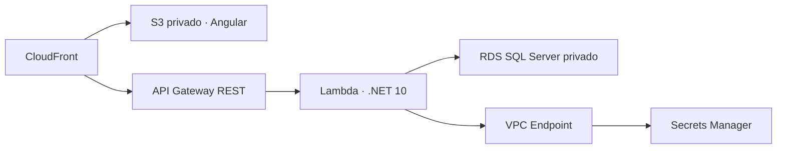

# Terraform y despliegue de Development

Esta guía explica cómo crear la infraestructura inicial, conectar GitHub Actions con AWS mediante OIDC y desplegar el ambiente `Development`.

## Qué se despliega



El frontend y la API comparten el dominio HTTPS generado por CloudFront. Esto permite cookies `Secure` y `SameSite=Strict` sin configurar un dominio personalizado ni CORS entre sitios diferentes.

El diagrama editable está en [`architecture/student-management-aws-architecture.drawio`](architecture/student-management-aws-architecture.drawio).

## Dos raíces de Terraform

### `terraform/bootstrap`

Se ejecuta una sola vez y crea los recursos necesarios para que el despliegue normal pueda funcionar:

- Bucket S3 privado para el estado remoto.
- Versionado y cifrado AES-256 del estado.
- Bloqueo de acceso público.
- Proveedor OIDC de GitHub.
- Rol IAM que GitHub Actions asume temporalmente.
- Service-linked role de RDS.

Este root utiliza estado local porque crea precisamente el bucket que después almacenará el estado remoto. Conserva de forma segura su archivo de estado local o migra también este root a un backend administrado después del bootstrap. El estado no debe subirse a Git.

### `terraform/development`

Administra la aplicación:

- VPC `10.42.0.0/16`.
- Dos subredes privadas `/20` en zonas de disponibilidad diferentes.
- Security Groups de Lambda, RDS y el endpoint.
- VPC Interface Endpoint de Secrets Manager.
- RDS SQL Server Express.
- Contraseñas aleatorias y secreto de aplicación.
- Rol IAM y función Lambda.
- API Gateway REST.
- Bucket S3 privado, Origin Access Control y CloudFront.

Su bloque `backend "s3" {}` se completa en cada ejecución con `-backend-config`, por lo que nombres de cuenta o región no quedan escritos en el repositorio.

## Requisitos

- Cuenta AWS con permisos administrativos para el bootstrap.
- AWS CLI autenticada.
- Terraform `>= 1.10`.
- Repositorio GitHub `JorgeQ12/LT_StudentManagement`.
- Rama `development`.

Verifica la sesión:

```powershell
aws sts get-caller-identity
terraform version
```

## Bootstrap inicial

Desde la raíz del repositorio:

```powershell
$AwsRegion = "us-east-1"
$AccountId = aws sts get-caller-identity --query Account --output text
$StateBucket = "student-management-tf-state-$AccountId-$AwsRegion"

terraform -chdir=infrastructure/terraform/bootstrap init
terraform -chdir=infrastructure/terraform/bootstrap plan `
  -var="aws_region=$AwsRegion" `
  -var="state_bucket_name=$StateBucket"

terraform -chdir=infrastructure/terraform/bootstrap apply `
  -var="aws_region=$AwsRegion" `
  -var="state_bucket_name=$StateBucket"
```

Obtén los valores que necesitará GitHub:

```powershell
terraform -chdir=infrastructure/terraform/bootstrap output
```

Si la cuenta ya tiene el proveedor OIDC `token.actions.githubusercontent.com`, no intentes crear otro. Debes importar el existente al estado de este root o adaptar el Terraform para referenciarlo como `data`.

## Configuración de GitHub

En el repositorio crea un Environment llamado exactamente `Development`:

`Settings → Environments → New environment → Development`

Agrega estas **Environment variables**:

| Variable | Origen |
| --- | --- |
| `AWS_REGION` | Región elegida, actualmente `us-east-1`. |
| `AWS_ROLE_ARN` | Output `github_deployer_role_arn` del bootstrap. |
| `TF_STATE_BUCKET` | Output `state_bucket_name` del bootstrap. |

No es necesario crear `AWS_ACCESS_KEY_ID` ni `AWS_SECRET_ACCESS_KEY`.

### Cómo funciona OIDC

1. El workflow declara `id-token: write`.
2. GitHub emite un token firmado para el job.
3. `aws-actions/configure-aws-credentials` presenta el token a AWS STS.
4. AWS verifica audiencia, repositorio, rama o environment usando la trust policy.
5. STS entrega credenciales temporales al job.
6. Las credenciales expiran al finalizar la ejecución.

La trust policy limita el rol al repositorio y al environment/rama configurados. La policy adjunta concede los permisos necesarios para administrar la infraestructura de Development.

## Despliegue automático

El workflow [`.github/workflows/development-deploy.yml`](../.github/workflows/development-deploy.yml) se activa con push a `development` cuando cambia API, frontend, infraestructura o el propio workflow.

| Archivos modificados | Acción |
| --- | --- |
| `StudentManagementApi/**` | Compila Lambda, aplica Terraform y verifica la API. |
| `StudentManagementWeb/**` | Compila Angular, sincroniza S3 e invalida CloudFront. |
| `infrastructure/**` | Despliega backend y frontend. |
| Workflow | Despliega backend y frontend. |
| `workflow_dispatch` | Redeploy completo. |

Aunque un despliegue sea solo de frontend, el job ejecuta `terraform init`: necesita leer los outputs del estado remoto para conocer el bucket de publicación y la distribución CloudFront. No ejecuta `terraform apply`.

## Despliegue manual con Terraform

Primero construye el paquete Lambda:

```powershell
dotnet publish `
  StudentManagementApi/StudentManagementApi.Presentation.Lambda `
  -c Release `
  -r linux-x64 `
  --self-contained false `
  -o StudentManagementApi/artifacts/lambda
```

Genera el ZIP manteniendo los archivos en la raíz del paquete:

```powershell
Compress-Archive `
  -Path StudentManagementApi/artifacts/lambda/* `
  -DestinationPath StudentManagementApi/artifacts/student-management-api.zip `
  -Force
```

Después inicializa el backend:

```powershell
$AwsRegion = "us-east-1"
$StateBucket = "<output state_bucket_name>"

terraform -chdir=infrastructure/terraform/development init `
  -backend-config="bucket=$StateBucket" `
  -backend-config="key=student-management/development/terraform.tfstate" `
  -backend-config="region=$AwsRegion" `
  -backend-config="use_lockfile=true"
```

Revisa y aplica:

```powershell
terraform -chdir=infrastructure/terraform/development plan `
  -var="aws_region=$AwsRegion" `
  -var="lambda_package_path=../../../StudentManagementApi/artifacts/student-management-api.zip"

terraform -chdir=infrastructure/terraform/development apply `
  -var="aws_region=$AwsRegion" `
  -var="lambda_package_path=../../../StudentManagementApi/artifacts/student-management-api.zip"
```

Consulta las salidas:

```powershell
terraform -chdir=infrastructure/terraform/development output
```

## Base de datos e inicialización

RDS es privado. La Lambda de Development aplica las migraciones EF Core pendientes durante su arranque porque Terraform configura `DatabaseInitialization__ApplyMigrations=true`.

Después, `AdministratorBootstrapper` crea el administrador si todavía no existe. La operación es idempotente: múltiples arranques no crean cuentas duplicadas.

El correo predeterminado es `admin@studentmanagement.local`. La contraseña se genera aleatoriamente y se almacena en Secrets Manager. Recupérala localmente:

```powershell
$SecretName = terraform -chdir=infrastructure/terraform/development output -raw application_secret_name
$ApplicationSecret = aws secretsmanager get-secret-value `
  --region us-east-1 `
  --secret-id $SecretName `
  --query SecretString `
  --output text | ConvertFrom-Json

$ApplicationSecret.BootstrapAdministratorPassword
```

No imprimas este valor en GitHub Actions ni lo copies a documentación, issues o commits.

## Estado remoto

El estado de Terraform contiene información sensible, incluidas las contraseñas generadas por `random_password`. Por eso el bucket tiene:

- Acceso público bloqueado.
- Cifrado en reposo.
- Versionado para recuperación.
- Bloqueo mediante archivo S3 durante operaciones concurrentes.

Nunca edites el estado manualmente. Para adoptar un recurso existente utiliza `terraform import`; para renombrar direcciones usa bloques `moved` o `terraform state mv` con respaldo.

## Costos y decisiones de Development

- RDS utiliza `db.t3.micro`, 20 GB gp3 y SQL Server Express para ser compatible con AWS Free Plan.
- RDS es Single-AZ, conserva un día de backups y no tiene deletion protection.
- El VPC Interface Endpoint de Secrets Manager genera un costo recurrente.
- La distribución CloudFront, S3, Lambda y API Gateway dependen del uso.

Estas decisiones priorizan una demostración funcional. No representan por sí solas una topología productiva.

## Destruir el ambiente Development

Ejecuta manualmente el workflow **Destroy Development Infrastructure** desde GitHub Actions y escribe `DESTROY-DEVELOPMENT` como confirmación.

El proceso elimina los recursos administrados por el estado `student-management/development/terraform.tfstate`: RDS, Lambda, API Gateway, CloudFront, S3 del frontend, VPC, subredes, endpoints, secretos y roles propios de la aplicación.

La eliminación es permanente y no conserva snapshots de la base de datos. El bootstrap se conserva: no se eliminan el bucket del estado, el proveedor OIDC ni el rol con el que GitHub se autentica. Por eso el ambiente puede crearse nuevamente ejecutando **Deploy Development**.

GitHub solamente muestra el botón **Run workflow** para workflows presentes en la rama predeterminada. Mientras `main` sea la rama predeterminada, este workflow debe estar en `main`; alternativamente, cambia la rama predeterminada a `development` o fusiona `development` en `main`.

## Diagnóstico rápido

| Problema | Revisión |
| --- | --- |
| GitHub no puede asumir el rol | Nombre del Environment, `AWS_ROLE_ARN` y condiciones `sub`/`aud` de la trust policy. |
| Terraform no encuentra el estado | `TF_STATE_BUCKET`, región, key y permisos S3. |
| Lambda falla al iniciar | CloudWatch Logs, acceso al endpoint 443, secreto y conectividad RDS 1433. |
| La API responde pero el frontend no cambia | Contenido del bucket e invalidación CloudFront. |
| Una ruta Angular devuelve error | Respuestas personalizadas 403/404 de CloudFront hacia `/index.html`. |

## Más información

- [Guía técnica completa](guia-tecnica-completa.md)
- [Guía del diagrama](architecture/student-management-aws-architecture.md)
- [README principal](../README.md)
